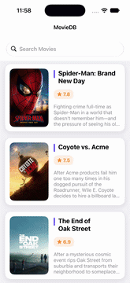

# MovieDB

An iOS movie application built with **Swift** and **UIKit** using **MVVM architecture** and **Dependency Injection**. The app fetches movie data from an API, supports movie search, displays movie details, and includes unit testing with mocks.

## Demo

<p align="center">
  
</p>

## Features

- Fetch and display movies from a REST API
- Search movies by title
- View detailed movie information
- Navigate between movie list and detail screens
- Asynchronous networking using `URLSession`
- JSON decoding using `Decodable`
- Image loading and caching
- MVVM architecture
- Dependency Injection
- Unit testing with mock dependencies

## Architecture

The project follows **MVVM** to separate UI, presentation logic, and data handling.

```text
View
  ↓
ViewModel
  ↓
Network Service
  ↓
Movie API
```

Dependencies are injected into the ViewModel, making the application easier to test and maintain.

## Tech Stack

- Swift
- UIKit
- MVVM
- Dependency Injection
- URLSession
- Decodable
- UITableView
- Auto Layout
- XCTest

## Testing

Unit tests use **XCTest** and mock ViewModels/services to test application logic independently from real network requests.

## Getting Started

```bash
git clone https://github.com/Laasya-73/MovieDB.git
```

Open the `.xcodeproj` file in Xcode, select a simulator, and run the application.

## Author

**Laasya Priya**  
GitHub: [@Laasya-73](https://github.com/Laasya-73)
